# NewsBit

NewsBit is an iOS news app built with SwiftUI.

It lets users create an account, read news, save stories, comment on posts, follow other users, and send messages. The app also has profile customization, highlighted stories, and search for both news and users.

## What This App Can Do

- Create an account and log in
- Log in with email or username
- Read news by category
- Open the full news details page
- Save stories to favorites
- Highlight stories on a user profile
- Add comments and replies
- Upvote and downvote comments
- Search news
- Search users
- Follow other users
- Send direct messages
- Share a news story in chat
- Upload a profile photo and cover photo
- Change avatar color

## Built With

- SwiftUI
- Firebase Authentication
- Cloud Firestore
- PhotosUI
- News API from `https://newsbitapi.onrender.com`

## Project Structure

- `NewsBit/` - main app source code
- `NewsBit.xcodeproj/` - Xcode project
- `images/` - UI screenshots used in this README

## Main App Areas

- `AuthViews.swift` - login and register screens
- `AuthViewModel.swift` - sign in, register, session restore, and profile loading
- `HomeView.swift` - news feed, story details, comments, and share flow
- `FavoritesView.swift` - saved stories
- `MessagesView.swift` - inbox, chat, and story sharing in messages
- `SearchView.swift` - search news and users
- `ProfileView.swift` - own profile, avatar, and cover image
- `VisitedUserProfileView.swift` - other user profile, follow, message, and highlights
- `NewsFeedService.swift` - feed API calls, categories, and story loading

## How To Run

1. Open `NewsBit.xcodeproj` in Xcode.
2. Wait for Xcode to download the Swift packages.
3. Make sure `NewsBit/GoogleService-Info.plist` matches your Firebase project.
4. In Firebase, turn on Email/Password sign-in.
5. Make sure Firestore is created and ready to use.
6. Choose an iPhone simulator or a real device.
7. Press Run.

## Backend Notes

This app uses Firebase for:

- user login
- user profile data
- favorites
- highlights
- follows
- comments and replies
- direct messages

This app uses the NewsBit API for:

- news feed
- category list
- full story details

If you change the bundle ID, you will also need a new `GoogleService-Info.plist` file from the matching Firebase iOS app.

## Screenshots

### Login And Register

  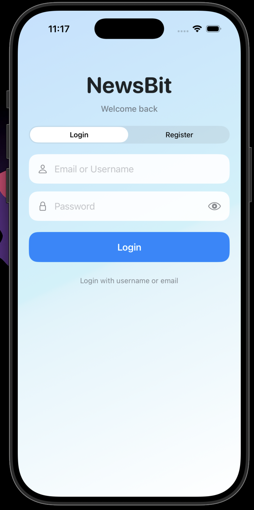
  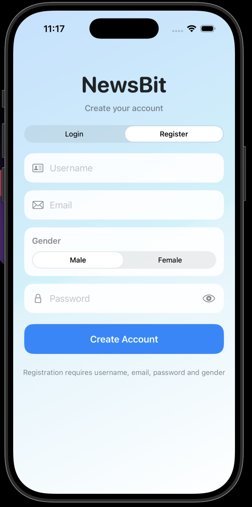

### News Feed And Reading

  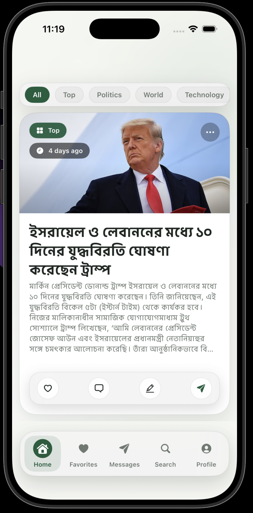
  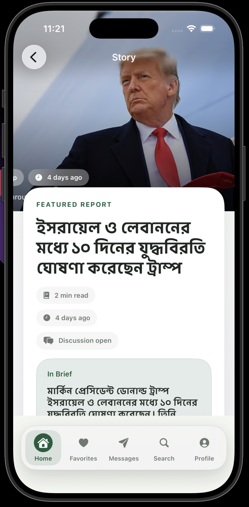
  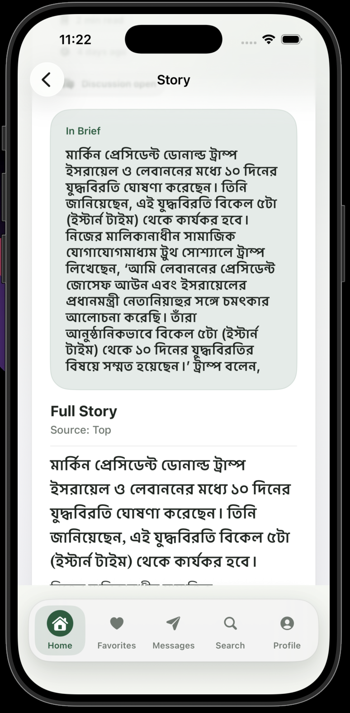

### Comments, Favorites, And Navigation

  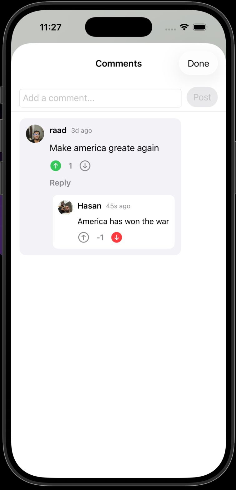
  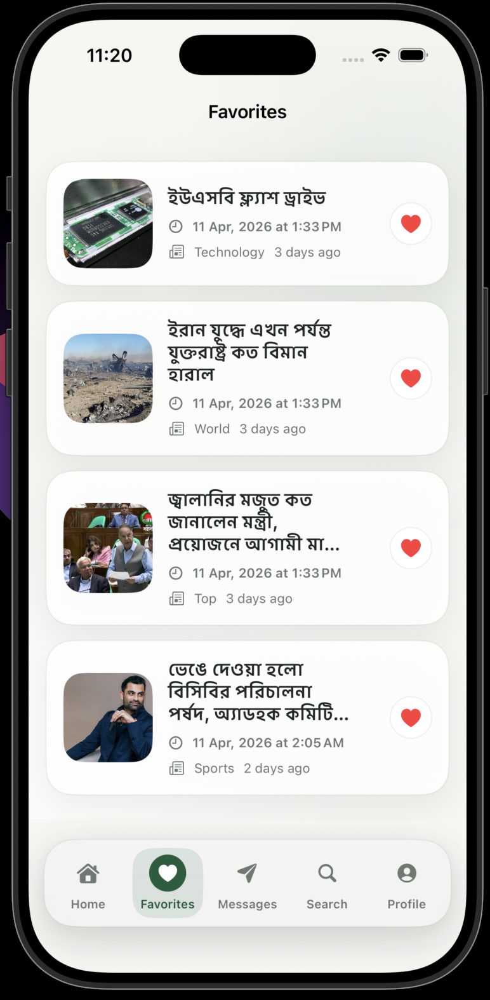
  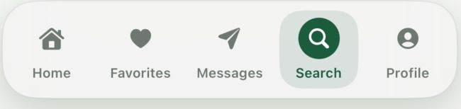

### Messages And Search

  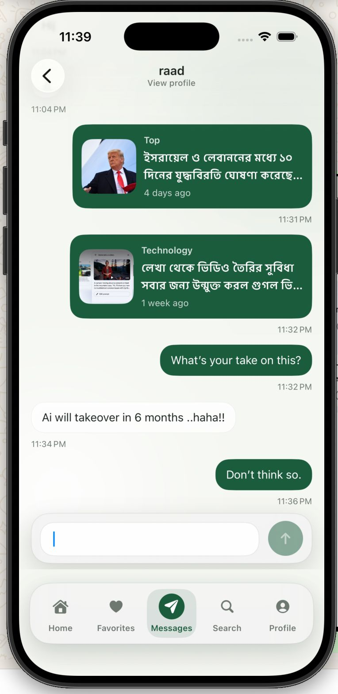
  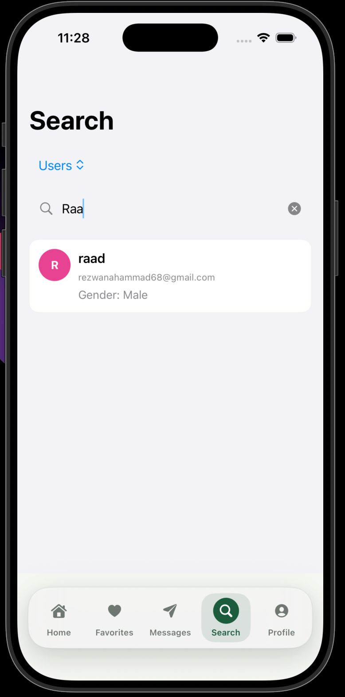

### Profile Screens

  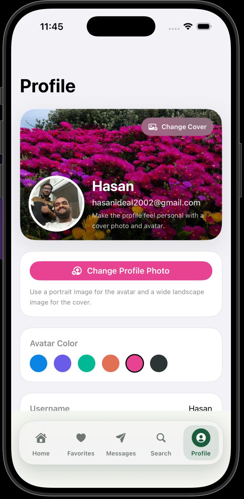
  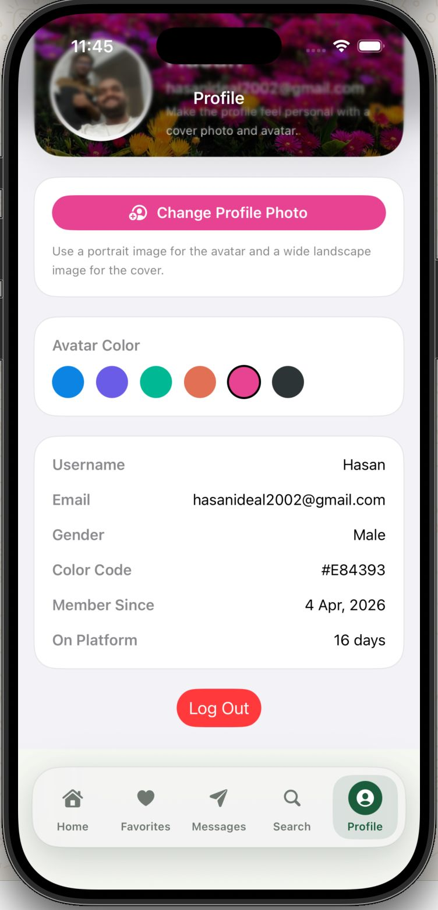
  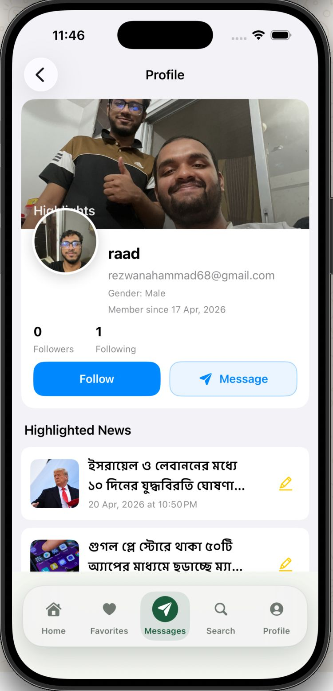

### User Highlights

  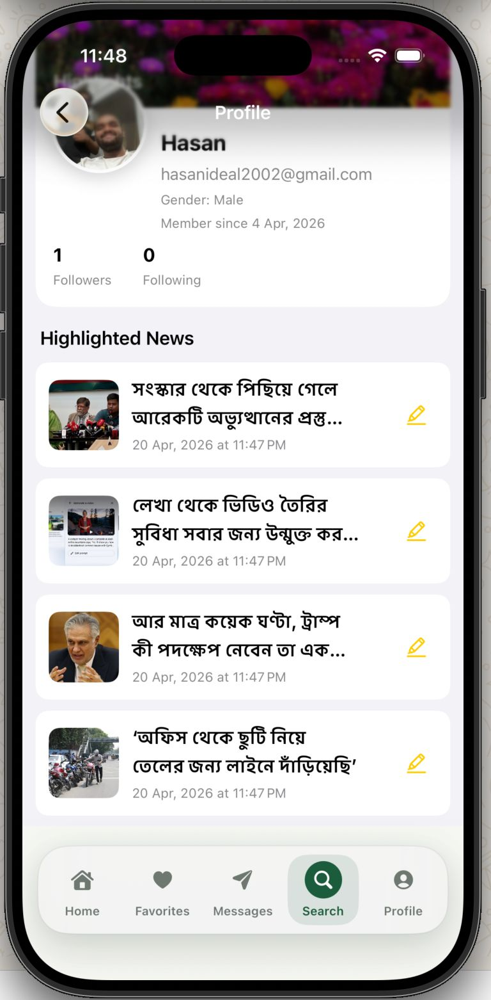

## Summary

NewsBit is a social news reading app for iPhone. It mixes reading, saving, commenting, following, and messaging in one place.
